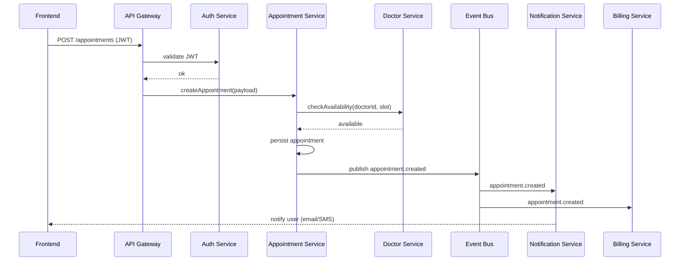

# HealthCareSystem — Architecture Overview

This document describes the intended architecture for the HealthCareSystem project (frontend + microservices). It is intended to be a single-source, high-level reference for developers, architects, and operators. It covers components, data flows, deployment, security, and scaling considerations, plus diagrams you can paste into Markdown renderers that support Mermaid.

---

## Goals & non‑functional requirements
- Modular microservices aligned to bounded contexts (patients, appointments, records, billing, notifications).
- High availability, horizontal scalability, and observability.
- Secure-by-design (authentication, authorization, encryption, audit).
- Event-driven where appropriate to decouple services (appointments → notifications, billing).
- Independent deployability of services; CI/CD pipeline per service.

---

## High-level components
- Frontend
  - SPA (React / Vue) in `frontend/` — user interfaces for Patients, Doctors, and Admin.
  - Public API consumption (via API Gateway). Uses JWT stored in HTTP-only cookie or secure storage.
- API Gateway / Ingress
  - Single entrypoint: routing, SSL termination, authentication (token validation), rate limiting.
  - Examples: NGINX Ingress (K8s), Kong, Traefik, AWS ALB.
- Authentication & Authorization
  - Auth Service issuing JWTs or delegated to Identity Provider (Keycloak / Auth0).
  - RBAC: roles (patient, doctor, admin, billing, system).
- Microservices (in `microservices/`)
  - patient-service: patient profiles and demographics.
  - doctor-service: doctor profiles, specialties, availability.
  - appointment-service: appointment creation, cancellation, scheduling logic.
  - records-service (EHR): health records, visits, attachments (documents, images).
  - billing-service: invoices, payments, insurance claims.
  - notification-service: emails, SMS, push notifications (connected to event bus).
  - gateway-service (optional internal gateway for internal service-to-service auth).
- Data stores
  - Each service owns its datastore (recommended: PostgreSQL per service).
  - Fast caches: Redis for sessions, temporary caches, rate limits.
  - Blob store: S3-compatible storage for large documents and imaging.
- Event Bus / Message Broker
  - Kafka or RabbitMQ for async events: appointment.created → notification + billing.
- Observability & Ops
  - Logging: structured logs shipped to a central system (ELK / Loki).
  - Metrics: Prometheus + Grafana.
  - Tracing: OpenTelemetry / Jaeger.
  - Health checks & readiness/liveness endpoints.
- CI/CD & Infra
  - Pipeline per service: build → test → container image → push → deploy.
  - Runtime: Kubernetes cluster (recommended). Helm charts or kustomize.
  - Secrets management: Vault / Kubernetes Secrets (encrypted at rest).
- External integrations
  - Insurance providers, lab systems, payment gateways.
  - Webhooks and secure API clients with mutual TLS or signed requests.

---

## Deployment topology (recommended)
- Kubernetes cluster(s)
  - Namespaces: dev / staging / prod
  - Ingress controller + cert-manager for TLS
  - HPA for services, PodDisruptionBudgets
  - Separate DB instances (managed RDS) or StatefulSets with backups
- Optional: separate cluster for sensitive data (EHR), or apply strict network policies and encryption to meet compliance.

---

## Data flow (example: patient books an appointment)
1. User (frontend) authenticates and requests to create appointment.
2. Frontend posts to API Gateway: POST /appointments
3. Gateway validates token, forwards to appointment-service.
4. appointment-service:
   - checks doctor availability (doctor-service) via sync call or cached availability
   - writes appointment record to its DB
   - publishes event appointment.created to Event Bus
5. notification-service subscribes to appointment.created → sends confirmation email/SMS
6. billing-service subscribes to appointment.created → creates provisional invoice
7. records-service remains decoupled, updated later by visit/doctor notes

Mermaid sequence (paste into a renderer that supports Mermaid):


---

## Component diagram (Mermaid)
```mermaid
graph LR
  subgraph User
    FE[Frontend (SPA)]
  end

  subgraph Edge
    GW[API Gateway / Ingress]
    CDN[CDN]
  end

  subgraph Auth
    AUTH[Auth Provider / JWT]
  end

  subgraph Services
    PAT[patient-service]
    DOC[doctor-service]
    APPT[appointment-service]
    REC[records-service]
    BILL[billing-service]
    NOTIF[notification-service]
  end

  subgraph Infra
    EB[Event Bus (Kafka/RabbitMQ)]
    DB[(Postgres per-service)]
    CACHE[(Redis)]
    S3[(Object Storage)]
    MON[Monitoring/Logging]
  end

  FE -->|HTTPS| CDN --> GW
  GW --> AUTH
  GW --> APPT
  GW --> PAT
  GW --> DOC
  GW --> REC
  GW --> BILL

  APPT --> DB
  PAT --> DB
  DOC --> DB
  REC --> DB
  BILL --> DB

  APPT --> EB
  EB --> NOTIF
  EB --> BILL

  NOTIF --> S3
  REC --> S3
  SERVICES --> CACHE
  SERVICES --> MON
```

---

## Storage and schema patterns
- Each service owns its schema — avoid shared DB between services.
- Use well-defined event contracts (JSON Schema or Protobuf) for the Event Bus.
- Store PII/PHI with encryption at rest and audited access.
- Maintain an audit log for all changes to patient records (immutable append log).

---

## Security & compliance
- TLS everywhere (ingress, service-to-service).
- Short-lived JWTs + refresh tokens; token revocation mechanism for compromised tokens.
- RBAC with least privilege; service accounts for inter-service communication.
- Logging of access to PHI with identifiers for audit.
- Data retention and purge policies.
- Consider HIPAA requirements for US deployments: Business Associate Agreement (BAA) with cloud provider, encryption, access logging.

---

## Observability & reliability
- Health endpoints: /healthz, /ready
- Centralized logs, metrics, and distributed tracing
- Alerts for latency, error rates, and resource saturation
- Chaos testing in staging to validate resilience

---

## Scaling & performance
- Stateless microservices behind HPA; databases scaled vertically or via read replicas.
- Use Redis for session/cache and rate limiting.
- Use batching and backpressure when consuming event streams.

---

## Suggested repo layout (example)
- /frontend — SPA code
- /microservices
  - /patient-service
  - /doctor-service
  - /appointment-service
  - /records-service
  - /billing-service
  - /notification-service
- /infra
  - /k8s — manifests or Helm charts
  - /charts
- /docs — design docs, API contracts, event schemas
- /ci — CI pipeline templates

---

## API & contract recommendations
- Use OpenAPI (Swagger) for all HTTP APIs.
- Publish API docs for frontend and external integrators.
- Version APIs and support deprecation windows.
- For events, publish JSON Schema + semantic versioning for event types.

---

## Next artifacts to create (recommended)
- ER diagram for each service data model (especially records-service).
- OpenAPI specs for critical services (appointments, auth, records).
- Event contract registry (schemas for appointment.created, record.updated).
- Deployment Helm charts or kustomize overlays for each environment.
- Security checklist and runbook for incident response.

---

## Example quick wins to implement now
- Add health/readiness endpoints to all services.
- Add standardized logging wrapper and correlation ID propagation (X-Request-Id).
- Add an API Gateway route for health and auth verification.
- Create a minimal mermaid service diagram in this repo's README for visibility.

---

## Glossary
- EHR: Electronic Health Record
- RBAC: Role-Based Access Control
- HPA: Horizontal Pod Autoscaler
- PHI: Protected Health Information